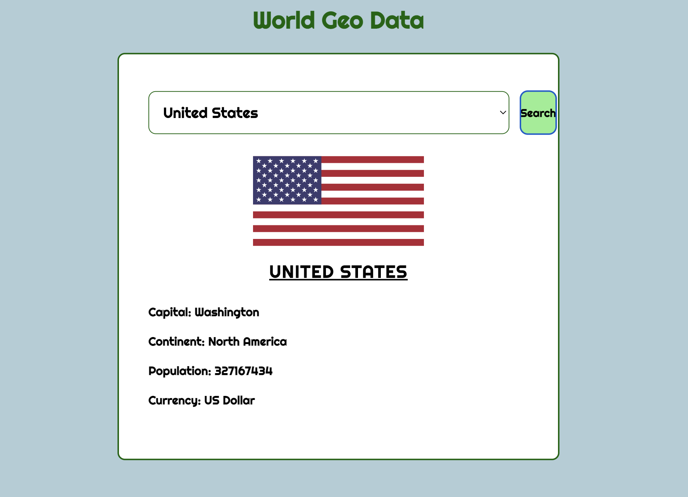

# Front-end Portfolio Project 

This project is designed to get the inforamtion about countries. For this assignment, you will build a world geographical data application that will make use of the [World Geo Data](https://rapidapi.com/natkapral/api/world-geo-data).

---

## Lab Setup

1. Create a Github repository.
2. Navigate to the repository's directory on your command line.
3. Open the repository in VSCode.
4. Follow the instructions below to complete the lab.

---

## Instructions

1. Create a <mark>**.html, .css, .js**</mark> files.
2. Use of CSS grid to organize your content.
3. You must use the :hover selector in at least one CSS rule.
4. You must use an HTML form on at least one of your pages.
5. All of your pages must have some visual changes that occur when the screen is a different size.
6. On page load, an external API request must be made. Upon receiving a successful response, something visual on the page should change.
7. When a form is submitted on your page, JavaScript should prevent the default behavior of that form and some other effect should take place.
8. There should be at least one way to incorrectly submit the form. When the form is incorrectly submitted, an error message should be added to the DOM for the user.
9. Based on a button click or form submission, an external API request must be made. Upon receiving a successful response, something visual on the page should change.
10. Submit the URL directly to Canvas.
11. Your project should be deployed to the web.

---
Your application outmcome should be like below.

